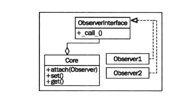

# 观察者模式

观察者模式在状态监测和事件处理等场景中是非常有用的。
这种模式可以确保一个核心对象可以由一组未知并可能正在扩展的“观察者对象”
来监控。一旦核心对象的某个值发生变化，它便可以通过调用`update()`函数
让所有观察者对象知道情况发生了变化。各个观察者在核心对象发生变化时，
有可能会负责处理不同的任务。

UML图如下：



代码实例：

核心对象：

```python
class Inventory:
    def __init__(self):
        self.observers = []
        self._product = None
        self._quantity = 0

    def attach(self, observer):
        self.observers.append(observer)

    @property
    def product(self):
        return self._product

    @product.setter
    def product(self, value):
        self._product = value
        self._update_observers()

    @property
    def quantity(self):
        return self._quantity

    @quantity.setter
    def quantity(self, value):
        self._quantity = value
        self._update_observers()

    def _update_observers(self):
        for observer in self.observers:
            observer()

```

观察者：

```python
class ConsoleObserver:
    def __init__(self, inventory):
        self.inventory = inventory

    def __call__(self):
        print(self.inventory.product)
        print(self.inventory.quantity)
```

观察者模式可以将正在被观察的代码和执行观察的代码分离。